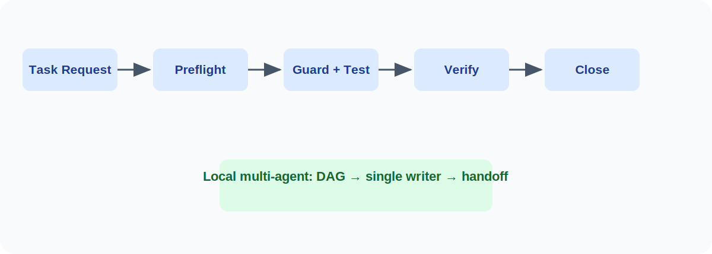

# Coding Agent Governance

> 面向 AI 编码 Agent 工作流的确定性范围控制、证据验证与任务收口层。

原仓库名：`ai-agent-project-governance`。

[](requirements-governance.txt)
[](LICENSE)
[](VERSION)

[English](README.md) | [简体中文](README.zh-CN.md)

## 让 AI 编码任务可控、可验证、可收口

上层工作流可以帮助 Agent 澄清需求、设计和施工；本项目独立检查实际改动是否越界、证据是否有效、任务是否可以收口。

它重点处理以下失控情形：

- 修改 TaskContract 授权范围之外的文件；
- 没有运行相关测试，或测试与改动无关；
- 工作区已变化却复用旧验证；
- 没有证据就宣称完成或交接。

最快体验方式：

```bash
python3 examples/demo/run_visual_proof.py
```

Windows PowerShell 请使用 `python`。该命令只创建临时合成仓库，展示越界阻断、过期验证阻断与成功收口；详见 [Demo](docs/DEMO.md)。

## 它在工作流中的位置

它不是 [Superpowers](docs/SUPERPOWERS_COMPATIBILITY.md)、`AGENTS.md`、TDD 实践、通用开发方法论或子 Agent 编排器的替代品。

| 上层工作流 | 本项目的治理层 |
| --- | --- |
| 澄清需求、设计、制定计划，并可协调 Agent | 将受限任务映射为 TaskContract，检查实际范围，登记测试证据，拒绝过期验证，生成 Closure/Handoff |

两者互补，且本项目不绑定任何特定工作流。仓库提供离线文档映射示例；不宣称 Superpowers 官方集成、插件或端到端兼容。见 [兼容性说明](docs/SUPERPOWERS_COMPATIBILITY.md) 与[最小工作流映射](docs/WORKFLOW_INTEGRATION.md)。

## 它解决什么问题

让 Agent 改动仓库时，难点往往不在生成代码，而在于：变更是否越界、测试是否真正相关、是否在未验证时宣称完成、多人协作会不会冲突，以及结果能否被后续交接追溯。

这个仓库为这些问题提供本地治理运行时：

- 明确任务范围和受保护路径；
- 按任务选择测试并保存验证证据；
- 在验证过期时阻止错误收口；
- 为多 Agent 协作提供结构化交接和单写者保护。

### 不只是 `AGENTS.md` 或 Prompt

`AGENTS.md` 或 Prompt 可以指导 Agent；本项目在此基础上提供可执行检查：合同、范围 Guard、测试规划、验证和收口记录。它用于降低常见失误，不宣称能够完全避免所有 Agent 错误，也不代表与第三方产品存在官方集成。

## 本地快速验证

克隆仓库后，运行现有的本地检查入口：

```powershell
git clone https://github.com/vanlew1/coding-agent-governance.git
cd coding-agent-governance
python -m pip install -r requirements-governance.txt
python scripts/run_governance_ci.py
```

最后一条命令会运行仓库已有的治理检查，并在终端输出结果。

## 当前状态与默认边界

| 项目 | 当前且谨慎的说明 |
| --- | --- |
| 版本 | `1.1.0` |
| 自动化 | 仓库包含名为 `Governance CI` 的 GitHub Actions workflow。 |
| Release | 已有 `v1.0.0` Release；其中的测试产物属于历史记录，不代表当前 `main` 的实时状态。 |
| 运行时覆盖 | Python、Node.js、微信小程序和通用 fallback 均有本地 Adapter 验收证据。详见[兼容性](docs/COMPATIBILITY.md)。 |
| Agent 兼容性 | Codex 仅为 instruction-compatible；Claude Code、Cursor 和 GitHub Copilot 尚无已记录的端到端验证。 |

默认情况下，运行时不会自动访问生产系统、写入生产数据、调用远端 API、启动第三方 Agent、安装依赖、创建 worktree、提交、推送、部署或发布。本地 audit 除非显式传入 `--output`，否则为只读。

## 它帮助避免什么

- 修改 TaskContract 范围外的文件。
- 执行与变更无关的测试，或跳过必跑检查。
- 没有验证证据就宣称完成。
- 工作区变化后仍复用旧验证进行收口。
- 多个 Agent 缺少单写者保护地修改同一文件。

## 如何工作



| 仅有静态说明 | 本治理运行时增加 |
| --- | --- |
| 告诉 Agent 不要修改什么 | Guard 检查实际变更范围 |
| 要求 Agent 跑测试 | TestPlan 选择已登记命令 |
| 依赖完成声明 | Verification 与 Closure 决定是否完成 |
| 用自然语言交接 | Structured Handoff 记录归属和结果 |
| 人工协调 | DAG 与单写者保护暴露冲突 |

## 按你的目标继续阅读

| 如果你想… | 从这里开始 |
| --- | --- |
| 快速了解本地使用方式 | 先运行 [Demo](docs/DEMO.md)，再读[入门指南](docs/GETTING_STARTED.md) |
| 选择接入级别 | [Preset 指南](docs/PRESETS.md) |
| 在已有仓库接入运行时 | [已有项目接入](docs/EXISTING_PROJECT_ADOPTION.md)：`agent_adopt.py` 生命周期是推荐主路径，手动复制仅用于恢复 |
| 查看兼容性证据 | [兼容性](docs/COMPATIBILITY.md) |
| 了解 audit 与安全模型 | [Audit 说明](docs/ADOPTION_AUDIT.md) |
| 查看具体路径 | [Demo](docs/DEMO.md)：查看越界阻断、过期验证阻断与成功收口；另见 [示例](examples/README.md) |
| 复用上层工作流计划 | [工作流集成](docs/WORKFLOW_INTEGRATION.md) 与[离线映射示例](examples/superpowers_compat/README.md) |
| 准备公开发布 | [传播素材](docs/SHARE_KIT.md)、[发布文案](docs/LAUNCH_COPY.md) 与[仓库元数据](docs/GITHUB_TOPICS.md) |
| 贡献或获取帮助 | [贡献](CONTRIBUTING.md)、[安全](SECURITY.md) 与 [支持](SUPPORT.md) |

如需检查仓库维护项，请查看 [GitHub 仓库设置清单](docs/GITHUB_REPOSITORY_SETTINGS_CHECKLIST.md)。运行时本身不会修改这些远端设置。

## 许可证

MIT，见 [LICENSE](LICENSE)。
