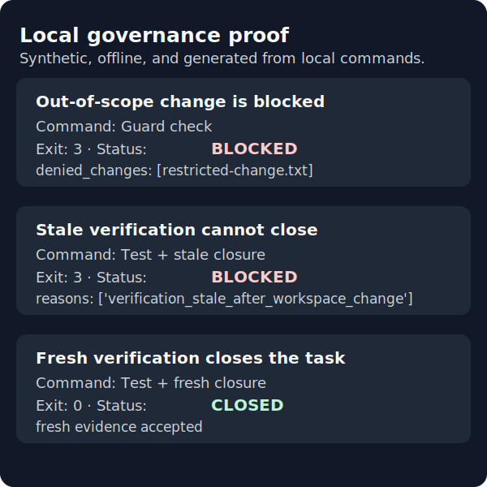

# Local visual proof

This offline walkthrough shows a small governance loop with real local commands and a disposable synthetic repository:

```text
risky action → governance block → clear reason → compliant correction → test → verified closure
```



The image is a concise status view. Its [plain-text transcript](assets/demo/visual-proof-transcript.txt) preserves the commands, real exit codes, and sanitized test summaries; the [status summary](assets/demo/visual-proof-summary.json) is machine-readable.

## Run it yourself without changing the repository

Run the command from the repository root. The default mode creates a new temporary output directory, prints its path, and leaves repository assets unchanged.

Windows PowerShell:

```powershell
python examples/demo/run_visual_proof.py
```

Linux, WSL, and macOS:

```bash
python3 examples/demo/run_visual_proof.py
```

The three temporary synthetic Git repositories are deleted automatically after the runner collects evidence. The temporary output directory is retained so you can inspect its SVG, transcript, and JSON files.

If your team already uses Superpowers or another planning workflow, keep using it for the upper-layer plan and map its bounded task into this runtime. The optional, offline [workflow mapping example](WORKFLOW_INTEGRATION.md) uses the same three proof paths; it does not require Superpowers to be installed.

## Maintainer-only asset refresh

Only maintainers intentionally refreshing the checked-in preview should run:

```bash
python3 examples/demo/run_visual_proof.py --publish-assets
```

`--publish-assets` is the only mode that writes `docs/assets/demo/`. Default mode and `--output-dir` reject repository-local output paths.

## What the three scenarios prove

| Scenario | Local action | Real outcome |
| --- | --- | --- |
| 1. Scope block | A task permits `src/` but changes synthetic `restricted-change.txt`. | Guard returns `BLOCKED` with exit code `3` and names the denied path. |
| 2. Stale verification | Guard passes, the focused synthetic unit test passes, then the workspace changes before closure. | Verification receives that real Guard/test evidence; Closure receives the observed stale condition and returns `BLOCKED` with exit code `3`. |
| 3. Fresh closure | Guard passes and the focused synthetic unit test passes against the allowed change. | Verification is `VERIFIED`; Closure is `CLOSED` with exit code `0`. |

Scenario 2 is deliberately narrow: it calls the existing closure evaluator with an explicit, observed `stale=True` condition after the synthetic workspace changes. It does not claim universal automatic workspace-change detection.

## Evidence and limits

Public assets use placeholders instead of local paths and contain no usernames, hostnames, credentials, access values, or external URLs. They are generated from local subprocess exit codes and sanitized output summaries; the sanitization does not alter a Guard, test, Verification, or Closure status.

This is a synthetic local demonstration, not evidence from a customer or deployed environment, and it does not claim third-party coding-agent certification.
