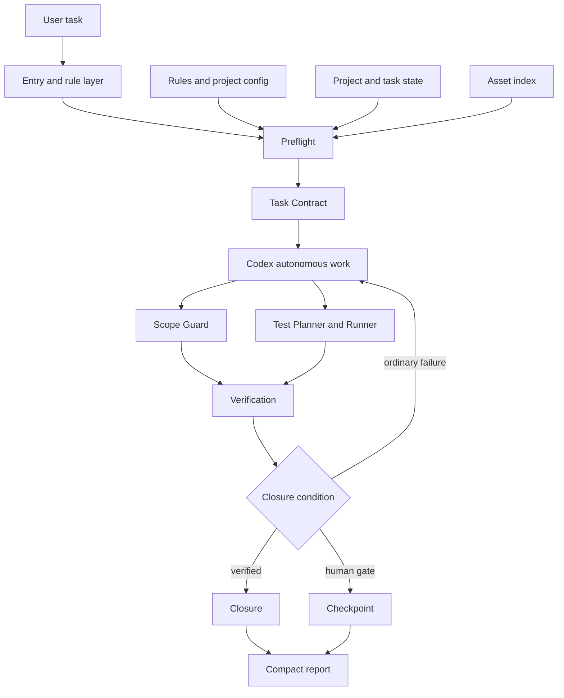

# Governance Runtime Target Architecture

## Status

- Architecture version: `1.0`
- Implementation status: `PHASE_5_SELF_VALIDATION_AND_CI`
- Runtime behavior enabled: `true` (Preflight only)
- Scope: the governance runtime architecture of this framework itself.
- Non-scope: `docs/ARCHITECTURE.template.md` remains the architecture template for downstream projects.

This is the single source of truth for the framework's governance-runtime architecture. It fixes the target design and its phased delivery order; it does not claim that the runtime behavior described below is already available.

## 1. Goals and Non-goals

The framework evolves from Markdown/YAML rules that rely primarily on Agent compliance into a system where rules state principles, a deterministic runtime computes a task contract, validators check outcomes, and Codex resolves normal engineering problems within the contract.

The target system must:

1. retain Codex autonomy for ordinary compilation, test, mock, fixture, import, path, naming, and local compatibility problems;
2. reduce unnecessary context and repeated work through minimal reads, reusable approvals, layered tests, and compact reports;
3. gate production writes, real external APIs, paid calls, irreversible operations, and new permissions;
4. make task level, write scope, tests, confirmations, and closure status structurally checkable;
5. retain `AGENTS.md`, `agent_rules/`, `docs/`, and the existing bootstrap flow; and
6. remain technology-neutral, with stack-specific defaults supplied only by adapters.

The framework is not a general code generator, LLM-agent platform, business workflow engine, cloud-hosted agent service, replacement for Git/CI/test frameworks, or an automatic approver of production risk. The first delivery does not include multi-agent scheduling, remote PR automation, a cloud console, a universal static-analysis platform, automatic business-boundary inference, or unapproved production operations.

## 2. Architecture Layers



| Layer | Responsibility | Calls an LLM |
| --- | --- | --- |
| Entry and rule | Declares global red lines, routing, and project-specific rules | No |
| Preflight and task contract | Converts a request into a structured task contract | No by default |
| State and approval | Keeps project mode, approvals, task state, and freshness | No |
| Work support | Provides scope checks, test planning, and asset reuse | No |
| Verification and closure | Aggregates validation and decides closure or checkpoint | No |
| Agent execution | Locates, edits, debugs, and resolves engineering work | Yes |

Deterministic local code must perform work that can be decided locally; the Agent must not repeatedly infer it from prose.

## 3. Target Repository Layout

```text
coding-agent-governance/
鈹溾攢 agent_rules/                         # Human/Agent-readable principles
鈹? 鈹溾攢 RULES_INDEX.yaml
鈹? 鈹溾攢 00_rule_router.md ... 15_plan_adaptation_rules.md
鈹? 鈹斺攢 16_autonomous_execution_rules.md  # planned after P0
鈹溾攢 governance/                          # Deterministic runtime, not business code
鈹? 鈹溾攢 cli.py
鈹? 鈹溾攢 models/       # project_state, task_request, task_contract, approval, verification, execution_event
鈹? 鈹溾攢 preflight/    # engine, mode, classification, risk, gate, scope, contract
鈹? 鈹溾攢 policy/       # loader, registry, precedence, validator
鈹? 鈹溾攢 state/        # store, approvals, freshness, migration
鈹? 鈹溾攢 guards/       # scope, forbidden operations, secrets, git
鈹? 鈹溾攢 verification/ # planning, running, normalization, closure, reports
鈹? 鈹溾攢 assets/       # locator, manifest, compatibility
鈹? 鈹斺攢 adapters/     # base, generic, python, node, wechat_miniprogram
鈹溾攢 schemas/                             # Unique structural format constraints
鈹溾攢 config/                              # Configurable non-secret defaults
鈹溾攢 scripts/                             # Public command-line entry points
鈹溾攢 docs/                                # Long-lived framework and project facts
鈹溾攢 tests/                               # Framework tests, never downstream business tests
鈹斺攢 .agent_state/                        # Generated, ignored workspace state (future phase)
```

Directory boundaries are fixed: `agent_rules/` declares principles; `governance/` implements deterministic runtime behavior; `schemas/` constrains all structured files; `config/` contains non-secret policy defaults; `docs/` records durable facts; `tests/` validates the framework. `.agent_state/` is a future generated directory and must remain untracked. It is not created in P0.

## 4. Core Contracts

Schemas are the single source of truth for all structured fields. Future Python models, YAML state files, and CLI output must conform to `schemas/`, rather than defining parallel fields.

| Contract | Purpose | Required concepts |
| --- | --- | --- |
| `TaskRequest` | Captures the user's request without embedding governance conclusions | ID, title, description, requester/time, hints and likely paths/risk hints |
| `ProjectState` | Stores durable project facts independent of a conversation | mode, architecture/plan state, root, adapter, high-risk paths, default forbidden operations |
| `ApprovalRecord` | Records a human approval and whether it remains reusable | task, approval type/status/scope, environment fingerprint, approver/time, expiry triggers |
| `TaskContract` | The compact work order used before an Agent starts | objective, read/write scope, autonomy, stop conditions, verification, report fields |
| `VerificationResult` | Normalizes scope, forbidden-operation, test, closure, and residual-risk outcomes | checks, test list, status, remaining risks |

`TaskContract` expresses task level `A`, `B`, or `C`, and lifecycle status `DRAFT`, `READY`, `BLOCKED`, `ACTIVE`, or `CLOSED`. It explicitly grants autonomy to debug ordinary test failures, edit adjacent tests when permitted, and conditionally edit same-module helpers, while forbidding unapproved architectural expansion. `VerificationResult` uses `VERIFIED`, `PARTIAL`, `BLOCKED`, and `FAILED` as distinct closure states.

## 5. Target Task Lifecycle

1. A user request becomes a `TaskRequest`; unknown facts are marked unknown rather than silently inferred.
2. Preflight reads minimal project state, resolves project mode and level, detects risks and high-risk paths, checks reusable approvals, resolves read/write scope, chooses the minimum sufficient tests, and produces a compact `TaskContract`.
3. Codex reads the active contract plus directly related code, tests, and named rules, then performs engineering work autonomously within the contract.
4. Verification checks changed paths, forbidden operations, required tests and results, and whether a higher test level is required.
5. Closure returns exactly one of `VERIFIED`, `PARTIAL`, `BLOCKED`, or `FAILED`, followed by a compact report or checkpoint.

Preflight, state persistence, guards, planning/running tests, and closure are target behavior only in this baseline. P0 must not implement or enable them.

## 6. Autonomy and Stop Boundaries

Codex must independently investigate syntax, type, build, import, unit-test, mock/fixture, path, naming, and local tool compatibility issues. It may make direct same-module helper adjustments and related test adjustments where the contract allows them, and it must continue after a first unsuccessful implementation attempt.

Codex must stop only when user-only credentials, keys, or permission are missing; a real paid call lacks approval; a production database/evidence store would be written; an irreversible delete/overwrite/migration is required; user requirements materially conflict; an explicit forbidden boundary would be crossed; confirmed core architecture must change; or a new risk exceeds the approval scope.

Test failures, an unexpected file location, an additional same-module test, a first failed attempt, imperfect existing code quality, and the need to inspect adjacent code are not human blockers.

## 7. Rule Precedence

```text
Law, safety, and platform limits
  > explicit current human prohibitions
  > project-specific rules
  > current TaskContract
  > directory AGENTS.md
  > root AGENTS.md
  > generic agent_rules
  > default configuration
```

A task contract cannot bypass global safety rules. Project-specific rules may tighten generic rules but must not silently weaken data protection. The validator must detect conflicts before the Agent has to guess.

## 8. Token, Approval, and Test Discipline

Preflight should output only the objective, allowed/forbidden scope, mandatory tests, autonomy permissions, and true stop conditions. Approval freshness checks compare task, workspace, environment, risk scope, and expiry. Tests advance only when required: Level 1 is changed-point testing; Level 2 is relevant-module regression; Level 3 is cross-module, architecture, release, or total audit validation.

Local deterministic code performs schema validation, Git change enumeration, path matching, approval freshness, test selection, report-field construction, and rule-reference checking. Reports stay compact: modified files, core changes, tests, and risks.

## 9. Adapter Boundary

All adapters implement a common technical interface: detection, default validation commands, path classification, discovery of test commands, sensitive-path patterns, and generated-path patterns. The first target adapters are `generic`, `python`,
ode`, and `wechat_miniprogram`. They may provide stack defaults only; they must not infer business policy or depend on project business code.

## 10. Validation and CI Target

The eventual local commands are `validate_governance`, `agent_preflight`, `agent_verify`, and `agent_close`. CI will validate rule-index structure and references, template initialization, generated-project paths and placeholders, stable contract output, small-task minimal reads, non-blocking ordinary test failures, gates for live APIs/writes, scope violations, and contract compatibility.

The test hierarchy will contain unit tests for classification/risk/freshness/scope/test planning; integration tests for preflight-to-contract, contract-to-verification, blocked checkpoints, and compact closure; bootstrap tests for generated-project integrity; and contract tests for schemas and rule references. P0 provides only the schema and architecture baseline tests.

## 11. Compatibility and Migration

The framework retains `AGENTS.md`, existing `agent_rules/`, architecture/module/task templates, `START_HERE.bat`, and the current initializer. Future changes may simplify the root entry rules, register policy in `RULES_INDEX.yaml`, make code quality adapter-driven, and generate runtime state/configuration during bootstrap. The framework must never maintain duplicate task-classification truths, divergent parallel task-contract meanings, rule-text imports as business dependencies, committed private state, or indefinite compatibility forks.

## 12. Phased Delivery

| Phase | Goal | Permitted result |
| --- | --- | --- |
| P0 | Fix architecture, module ownership, schemas, ADR, validation, and tests | Baseline only; behavior disabled |
| P1 | Minimal task-request to contract loop | Models, Preflight, state, classification, Gate, CLI |
| P2 | Autonomy and range protection | execution rules, guards, approval freshness |
| P3 | Verification and closure | planner/runner, result, closure, compact reports |
| P4 | Adapters and bootstrap | generic/Python/Node/miniprogram adapters and initialization |
| P5 | Framework self-validation and CI | compatibility, CI, migration, release regression |
| P6 | Multi-agent cooperation | audit/implementation protocol, handoff, locks/conflicts |

Each task implements only its current phase. P0 precedes P1, and P1鈥揚6 behavior must not be introduced early.

## 13. Dependency Direction

```text
cli -> preflight -> policy/state/assets/adapters
verification -> guards/adapters/models
scripts -> governance public API

models -/-> cli or filesystem implementation
policy -/-> verification runner
adapters -/-> business code
agent_rules -/-> governance Python imports
state -/-> Codex or external models
```

Text rules may be loaded and parsed, but cannot become a hidden business dependency.

## 14. Single Sources of Truth

| Information | Authority |
| --- | --- |
| Framework runtime architecture | `docs/GOVERNANCE_RUNTIME_ARCHITECTURE.md` |
| Framework runtime modules | `docs/GOVERNANCE_RUNTIME_MODULE_REGISTRY.yaml` |
| Downstream project architecture | `docs/ARCHITECTURE.template.md` (renamed on bootstrap) |
| Structured fields | `schemas/` |
| Generic rule registry | `agent_rules/RULES_INDEX.yaml` |
| Project-specific boundaries | `agent_rules/11_project_specific_rules.md` |
| Active task, approvals, verification | future `.agent_state/` files |
| Formal task tracking / releases | downstream `docs/TASK_REGISTRY.yaml` / `docs/CHANGELOG.md` |

The same fact must not be maintained in conflicting chat records, reports, or parallel YAML files.

## 15. Architecture Acceptance Criteria

The completed architecture must support proof that a pure A-class text task reads only quick context, its contract, and related files; ordinary repair-test failures continue autonomously; unapproved live API requests generate a checkpoint without edits or calls; valid approvals are reusable; scope violations are discoverable; tests can escalate 1鈫?鈫?; compact outputs avoid diffs; initialized projects self-validate; supported stacks share the same core runtime; CI validates rules/schemas/templates; and necessary safety/rollback/testing is never skipped to save tokens.

P0 acceptance is narrower: this document, the separate module registry, schemas, non-behavioral package markers, baseline validator, and baseline tests must be present and mutually valid; existing routing must remain unchanged; and `runtime_behavior_enabled` must remain `false`.

## P1 Implemented Baseline

P1 provides the deterministic, read-only `scripts/agent_preflight.py` entry point for validated TaskRequest and ProjectState inputs. It generates and revalidates a TaskContract without writing `.agent_state`, executing tests, enforcing scope, reusing approvals, or closing tasks.

## P2 State and Guard Baseline

P2 adds explicit local state persistence, Approval freshness primitives, read-only changed-path collection, Scope classification, forbidden-operation evidence checks, and autonomy failure classification. Test planning/execution, Verification/Closure, adapters, and multi-agent behavior remain unimplemented.
## P3 Verification and Closure
P3 provides allowlisted test planning/execution, verification, closure, and compact reports.

## P4 Adapters and Bootstrap
P4 provides deterministic generic, Python, Node, and WeChat Mini Program adapters, closed registry selection, adapter-aware test planning and guard path classification, and bootstrap adapter configuration.

## P5 Self-Validation and CI
P5 adds fixture-backed Schema compatibility, reference and dependency checks, isolated Bootstrap verification, a fixed local release gate, and read-only GitHub Actions CI. Multi-agent behavior remains disabled.


## PHASE_6_MULTI_AGENT_ORCHESTRATION

P6 adds a deterministic local orchestration layer: closed roles, schema-validated subtask contracts, DAG and single-writer validation, workspace assignments, structured handoffs and freshness checks, aggregation, and human-distributed prompt bundles. It does not start Agents, access remote APIs, create worktrees/branches, or perform Git writes.


## Governance Runtime V1 Close

V1 (1.0.0) completes the local deterministic P0?P6 runtime. It is locally validated by the fixed release gate and isolated single-/multi-agent CLI acceptance tests. Remote GitHub Actions validation remains an explicit post-commit/push activity and is not implied by this document.
